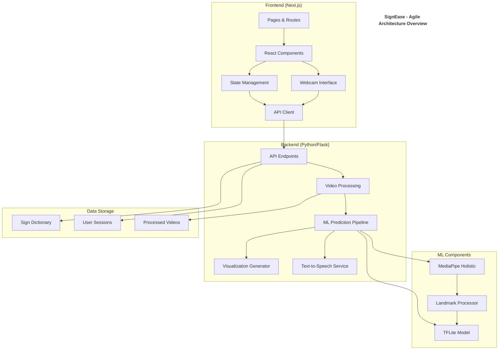
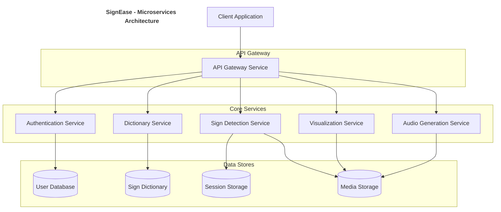
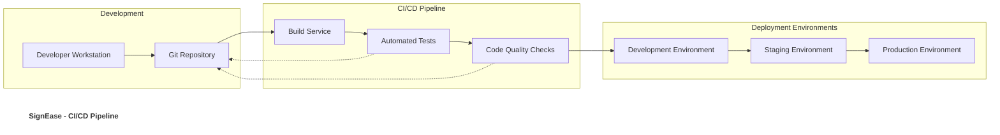
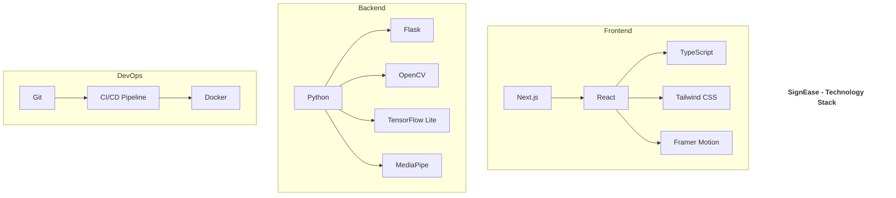

# SignEase Agile Architecture Diagram

In Agile development, architecture diagrams are kept high-level and focus on the major components and their interactions, allowing for flexibility and evolution as the project progresses.

## Microservices Architecture (Future Evolution)

## Deployment Pipeline

## Technology Stack

