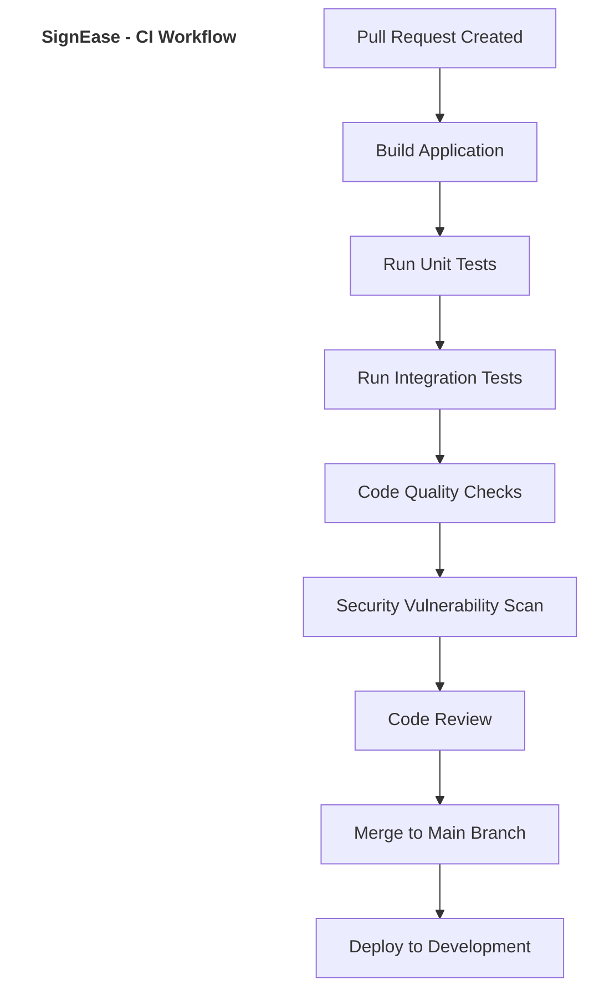
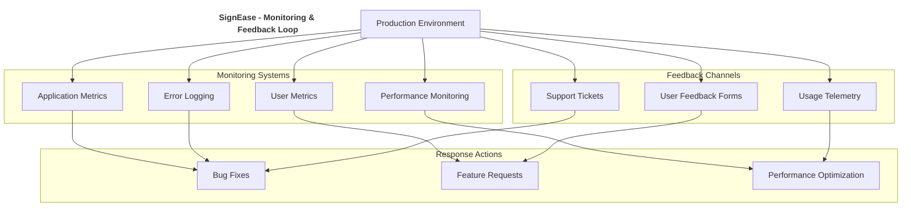

# SignEase Deployment Pipeline

In Agile development, continuous integration and deployment are essential for rapid iteration and feedback. This document outlines the deployment pipeline for the SignEase application.

```mermaid
graph LR
    title[<b>SignEase - Deployment Pipeline</b>]
    style title fill:none,stroke:none

    %% Development
    Dev[Developer]
    LocalTest[Local Testing]
    Git[Git Repository]

    %% CI/CD
    CI[CI/CD Service]
    Build[Build Process]
    Test[Automated Tests]
    Lint[Code Quality]
    Security[Security Scan]

    %% Environments
    DevEnv[Development Environment]
    Staging[Staging Environment]
    Prod[Production Environment]

    %% Monitoring
    Monitor[Monitoring & Logging]
    Feedback[User Feedback]
    Analytics[Usage Analytics]

    %% Flow
    Dev --> LocalTest
    LocalTest --> Git
    Git --> CI
    CI --> Build
    Build --> Test
    Test --> Lint
    Lint --> Security
    
    Security --> DevEnv
    DevEnv --> Staging
    Staging --> Prod
    
    Prod --> Monitor
    Monitor --> Feedback
    Feedback --> Dev
    Prod --> Analytics
    Analytics --> Dev

    %% Automated Rollback
    Prod -.-> Staging
```

## Continuous Integration Workflow

## Deployment Environments

### Development Environment
- **Purpose**: Testing new features during development
- **Deployment**: Automatic on merge to development branch
- **Data**: Test data only
- **Access**: Development team only
- **URL**: dev.signease.example.com

### Staging Environment
- **Purpose**: Pre-production testing and QA
- **Deployment**: Manual promotion from development
- **Data**: Anonymized production-like data
- **Access**: Development team and stakeholders
- **URL**: staging.signease.example.com

### Production Environment
- **Purpose**: Live application for end users
- **Deployment**: Manual promotion from staging
- **Data**: Production data
- **Access**: Public
- **URL**: signease.example.com

## Monitoring and Feedback

## Deployment Checklist

### Pre-Deployment
- [ ] All tests passing
- [ ] Code review completed
- [ ] Security scan passed
- [ ] Performance benchmarks met
- [ ] Documentation updated

### Deployment
- [ ] Database migrations prepared
- [ ] Backup current production state
- [ ] Deploy to staging environment
- [ ] Verify staging deployment
- [ ] Schedule production deployment window
- [ ] Execute production deployment
- [ ] Verify production deployment

### Post-Deployment
- [ ] Monitor application metrics
- [ ] Monitor error logs
- [ ] Verify critical user flows
- [ ] Notify stakeholders of successful deployment
- [ ] Document any issues or lessons learned
