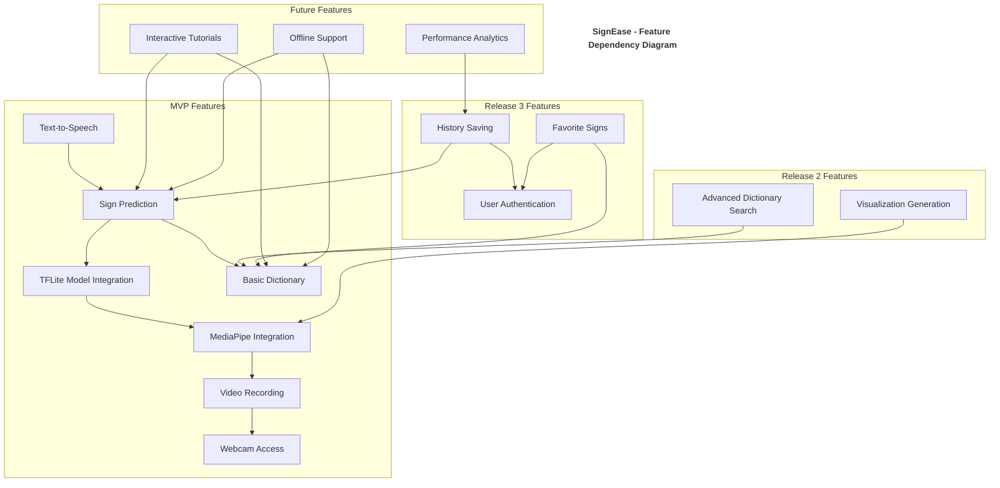
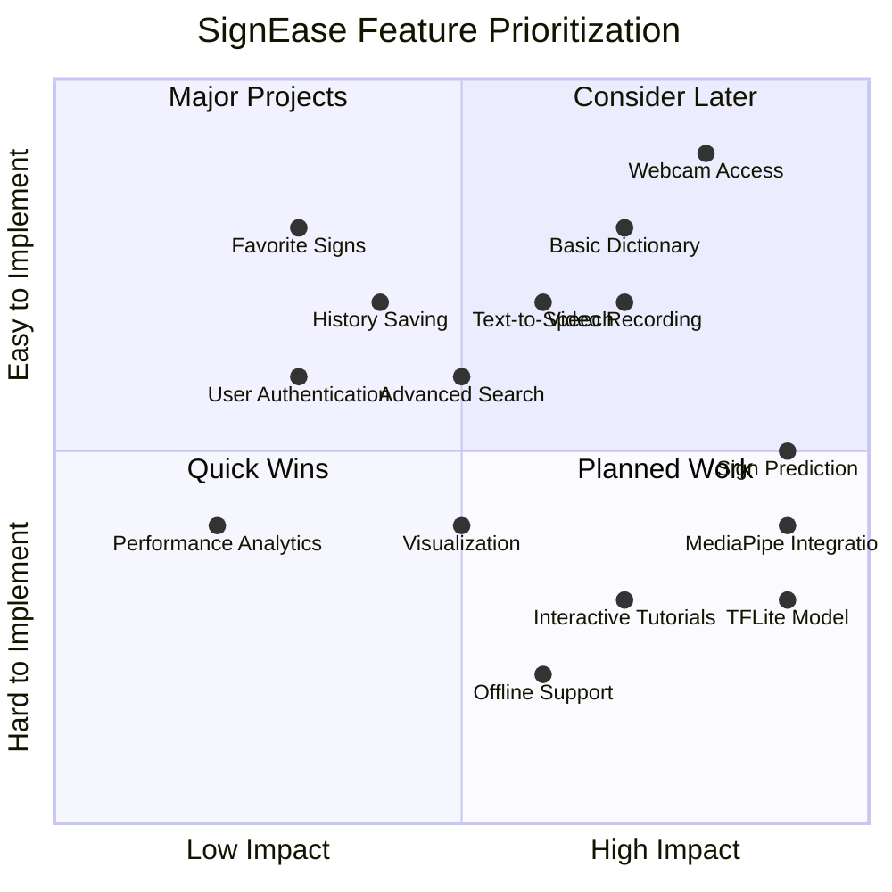

# SignEase Feature Dependency Diagram

In Agile development, understanding feature dependencies helps with sprint planning and prioritization. This diagram shows the relationships between features and their dependencies.

## Feature Prioritization Matrix

## Incremental Development Plan

### Sprint 1: Core Infrastructure
- Set up Next.js frontend
- Implement basic UI components
- Set up Flask backend
- Implement webcam access and recording
- Create basic API endpoints

### Sprint 2: ML Integration
- Integrate MediaPipe
- Set up TFLite model
- Implement landmark extraction
- Create basic prediction pipeline
- Set up basic dictionary

### Sprint 3: User Experience
- Implement sign prediction display
- Add text-to-speech functionality
- Enhance dictionary browsing
- Improve UI/UX
- Add basic error handling

### Sprint 4: Visualization
- Implement visualization generation
- Add visualization display
- Enhance prediction accuracy
- Improve performance
- Add advanced dictionary search

### Future Sprints
- User authentication
- History saving
- Favorites functionality
- Interactive tutorials
- Offline support
- Performance analytics
