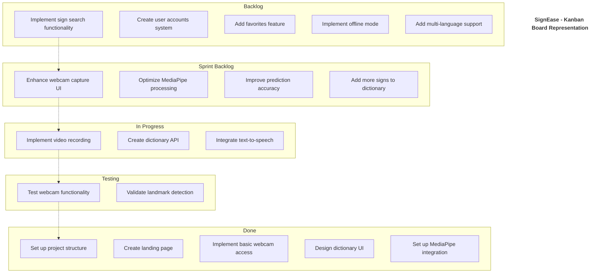
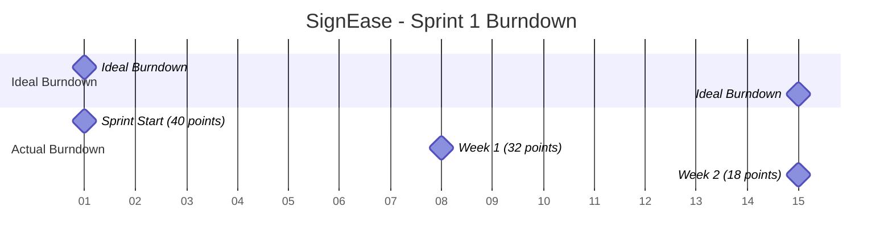
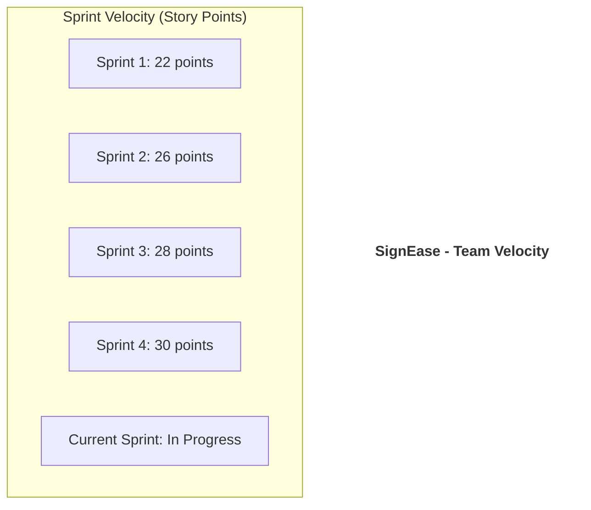

# SignEase Agile Kanban Board

## Sprint Burndown Chart

## Velocity Chart

## Daily Standup Questions

1. What did you accomplish yesterday?
2. What will you work on today?
3. Are there any blockers or impediments in your way?

## Definition of Done

- Code is written and passes all tests
- Code is reviewed by at least one team member
- Documentation is updated
- Feature is deployed to staging environment
- Product Owner has accepted the feature
