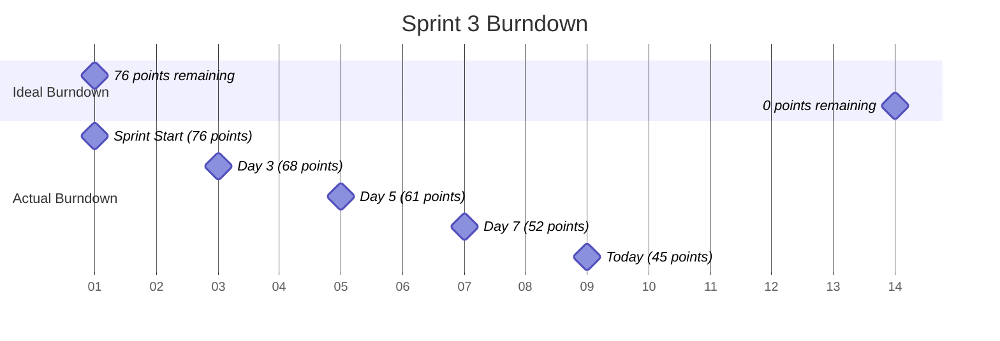

# SignEase Sprint Backlog

The Sprint Backlog is the set of Product Backlog items selected for the Sprint, plus a plan for delivering the product Increment and realizing the Sprint Goal. It is a forecast by the Development Team about what functionality will be in the next Increment and the work needed to deliver that functionality.

## Current Sprint: Sprint 3 (April 1 - April 14, 2023)

### Sprint Goal

**Complete the core sign detection functionality with basic visualization and improve the user experience of the dictionary feature.**

### Sprint Planning Notes

- Team capacity: 80 story points (5 team members, 8 points per person per week)
- Focus on completing the sign detection pipeline
- Improve dictionary functionality
- Begin work on visualization features

### Sprint Backlog Items

| ID | Type | Title | Description | Story Points | Assignee | Status |
|----|------|-------|-------------|--------------|----------|--------|
| US-002 | User Story | Video Recording | As a user, I want to record short videos for sign detection | 8 | Alex | In Progress |
| US-003 | User Story | Basic Sign Detection | As a user, I want the system to detect basic signs from my video | 13 | Maria | In Progress |
| US-005 | User Story | Text-to-Speech | As a user, I want to hear the detected sign pronounced | 5 | Carlos | In Progress |
| US-006 | User Story | Landmark Visualization | As a user, I want to see how the AI detects hand landmarks | 8 | Priya | To Do |
| US-007 | User Story | Dictionary Search | As a user, I want to search for specific signs in the dictionary | 5 | James | In Progress |
| US-008 | User Story | Sign Details | As a user, I want to view detailed information about each sign | 3 | James | To Do |
| TS-002 | Technical Story | TFLite Model Setup | Set up TensorFlow Lite model for sign prediction | 13 | Maria | In Progress |
| TS-004 | Technical Story | Video Processing Pipeline | Create pipeline for processing video frames | 13 | Alex | In Progress |
| TS-007 | Technical Story | Performance Optimization | Optimize application performance | 8 | Carlos | To Do |

### Tasks Breakdown

#### US-002: Video Recording

| Task | Description | Estimated Hours | Assignee | Status |
|------|-------------|-----------------|----------|--------|
| T-001 | Set up webcam component with recording controls | 4 | Alex | Done |
| T-002 | Implement video recording functionality | 6 | Alex | In Progress |
| T-003 | Add video preview functionality | 3 | Alex | To Do |
| T-004 | Implement video saving to backend | 4 | Alex | To Do |
| T-005 | Add error handling for webcam access | 2 | Alex | To Do |

#### US-003: Basic Sign Detection

| Task | Description | Estimated Hours | Assignee | Status |
|------|-------------|-----------------|----------|--------|
| T-006 | Create backend endpoint for sign detection | 4 | Maria | Done |
| T-007 | Implement video processing in backend | 8 | Maria | In Progress |
| T-008 | Connect TFLite model to processing pipeline | 6 | Maria | To Do |
| T-009 | Create response format for detection results | 3 | Maria | To Do |
| T-010 | Implement frontend display of detection results | 5 | Maria | To Do |

#### US-005: Text-to-Speech

| Task | Description | Estimated Hours | Assignee | Status |
|------|-------------|-----------------|----------|--------|
| T-011 | Research text-to-speech libraries | 2 | Carlos | Done |
| T-012 | Implement text-to-speech in backend | 6 | Carlos | In Progress |
| T-013 | Create API endpoint for audio retrieval | 3 | Carlos | To Do |
| T-014 | Implement audio playback in frontend | 4 | Carlos | To Do |
| T-015 | Add controls for audio playback | 2 | Carlos | To Do |

### Sprint Burndown Chart

### Daily Scrum Notes

#### April 9, 2023

**Alex:**
- Yesterday: Completed webcam component setup and started on recording functionality
- Today: Continue implementing video recording and work on preview functionality
- Blockers: None

**Maria:**
- Yesterday: Finished backend endpoint and worked on video processing
- Today: Continue with video processing implementation
- Blockers: Need clarification on video format requirements

**Carlos:**
- Yesterday: Completed research on text-to-speech libraries and started implementation
- Today: Continue implementing text-to-speech in backend
- Blockers: None

**Priya:**
- Yesterday: Completed documentation for previous sprint and prepared for landmark visualization
- Today: Start implementing landmark visualization component
- Blockers: Waiting for video processing pipeline to be completed

**James:**
- Yesterday: Started implementing dictionary search functionality
- Today: Continue with search implementation and prepare for sign details work
- Blockers: None

### Impediment Log

| Date | Impediment | Owner | Resolution | Status |
|------|------------|-------|------------|--------|
| 2023-04-03 | MediaPipe installation issues on Windows | Carlos | Provided alternative installation instructions | Resolved |
| 2023-04-05 | Unclear requirements for video format | Maria | Discussed with Product Owner and clarified requirements | Resolved |
| 2023-04-08 | Performance issues with video processing | Alex | Investigating optimization options | Open |
