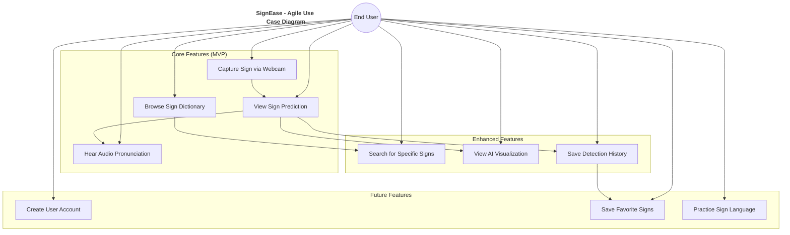

# SignEase Agile Use Case Diagram

In Agile methodologies, use case diagrams focus on user-centric functionality and are often simplified to highlight the core user interactions with the system.

## User Persona Examples

### Persona 1: Sarah - ASL Student
- **Background**: College student learning American Sign Language
- **Goals**: Practice signs, get feedback on accuracy, learn new signs
- **Pain Points**: Difficulty practicing without a partner, unsure if performing signs correctly
- **Key Features**: Sign detection, dictionary, visualization feedback

### Persona 2: Michael - Deaf Community Member
- **Background**: Deaf individual who uses sign language as primary communication
- **Goals**: Help others understand sign language, bridge communication gap
- **Pain Points**: Communication barriers with non-signers, lack of accessible technology
- **Key Features**: Text-to-speech output, comprehensive dictionary, shareable results

### Persona 3: Lisa - Educator
- **Background**: ASL teacher at a community college
- **Goals**: Provide students with practice tools, demonstrate sign language technology
- **Pain Points**: Limited classroom time, need for student practice resources
- **Key Features**: Visualization tools, comprehensive dictionary, educational content
