# SignEase Agile User Story Map

```mermaid
graph TD
    title[<b>SignEase - User Story Map</b>]
    style title fill:none,stroke:none

    %% Epics
    Epic1[Learn Sign Language]
    Epic2[Detect Sign Language]
    Epic3[Visualize AI Technology]
    Epic4[Accessibility Features]

    %% User Activities
    UA1[Browse Dictionary]
    UA2[Capture Signs]
    UA3[View Technology]
    UA4[Access Content]

    %% User Stories - Dictionary
    US1[As a user, I want to browse a sign language dictionary]
    US2[As a user, I want to search for specific signs]
    US3[As a user, I want to view detailed information about signs]
    US4[As a user, I want to see video demonstrations of signs]

    %% User Stories - Sign Detection
    US5[As a user, I want to capture my sign language through webcam]
    US6[As a user, I want to see real-time detection of my signs]
    US7[As a user, I want to hear audio pronunciation of detected signs]
    US8[As a user, I want to save my detection sessions]

    %% User Stories - Technology Visualization
    US9[As a user, I want to see how AI processes my signs]
    US10[As a user, I want to view landmark detection visualization]
    US11[As a user, I want to understand the technology behind the app]
    US12[As a user, I want to explore different visualization modes]

    %% User Stories - Accessibility
    US13[As a user, I want text-to-speech functionality]
    US14[As a user, I want keyboard navigation support]
    US15[As a user, I want high contrast mode]
    US16[As a user, I want responsive design for all devices]

    %% Connections - Epics to Activities
    Epic1 --- UA1
    Epic2 --- UA2
    Epic3 --- UA3
    Epic4 --- UA4

    %% Connections - Activities to User Stories
    UA1 --- US1
    UA1 --- US2
    UA1 --- US3
    UA1 --- US4

    UA2 --- US5
    UA2 --- US6
    UA2 --- US7
    UA2 --- US8

    UA3 --- US9
    UA3 --- US10
    UA3 --- US11
    UA3 --- US12

    UA4 --- US13
    UA4 --- US14
    UA4 --- US15
    UA4 --- US16

    %% Releases/Sprints
    subgraph "Release 1 - MVP"
    US1
    US5
    US6
    US13
    end

    subgraph "Release 2 - Enhanced Features"
    US2
    US3
    US7
    US9
    US14
    end

    subgraph "Release 3 - Complete Solution"
    US4
    US8
    US10
    US11
    US12
    US15
    US16
    end
```

## Sprint Backlog Items (Current Sprint)

| User Story | Task | Assignee | Status | Story Points |
|------------|------|----------|--------|--------------|
| US1 | Create dictionary database schema | Team Member 1 | Done | 3 |
| US1 | Implement dictionary API endpoints | Team Member 2 | In Progress | 5 |
| US1 | Design dictionary UI components | Team Member 3 | Done | 3 |
| US5 | Set up webcam capture functionality | Team Member 4 | Done | 5 |
| US5 | Implement video recording and saving | Team Member 1 | In Progress | 3 |
| US6 | Create backend prediction endpoint | Team Member 2 | To Do | 8 |
| US6 | Implement frontend results display | Team Member 3 | To Do | 5 |
| US13 | Integrate text-to-speech library | Team Member 4 | In Progress | 3 |
