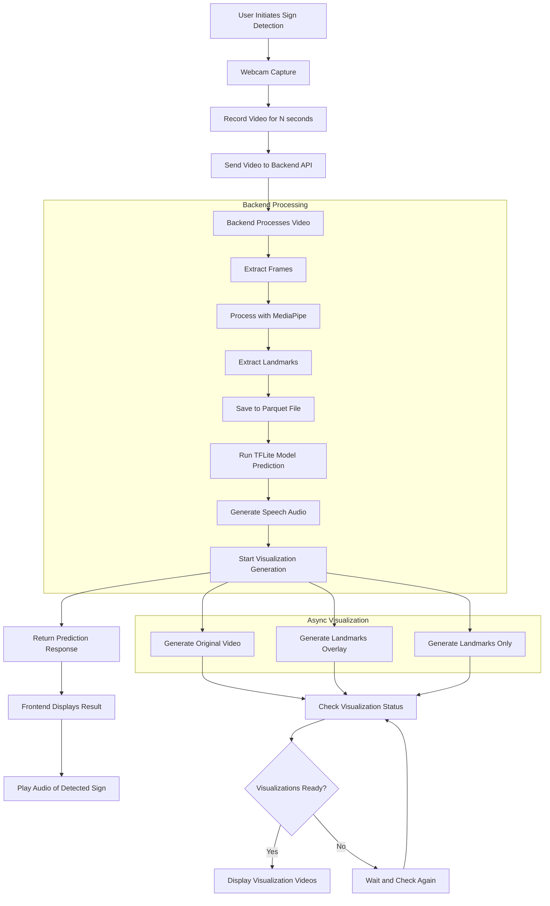
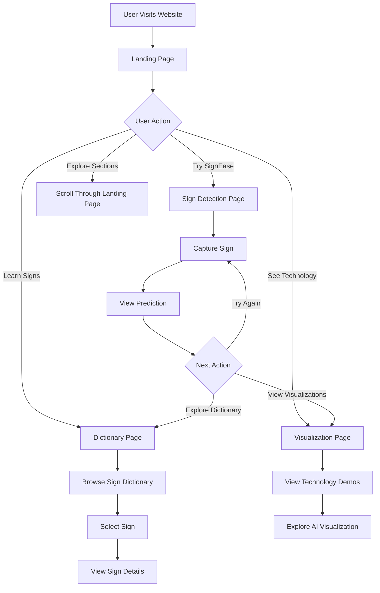
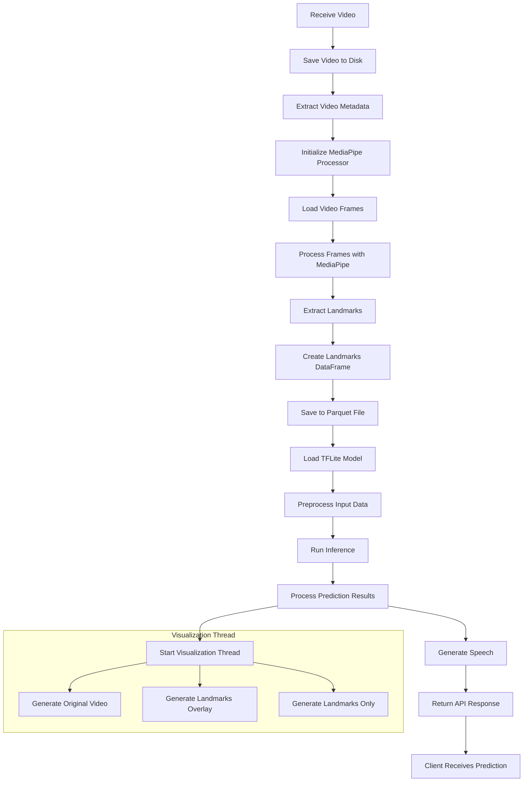
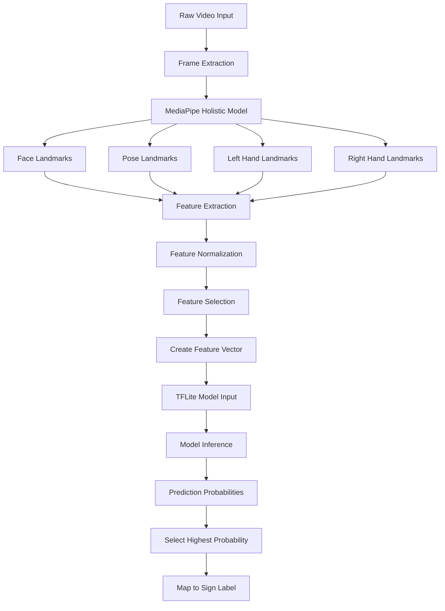
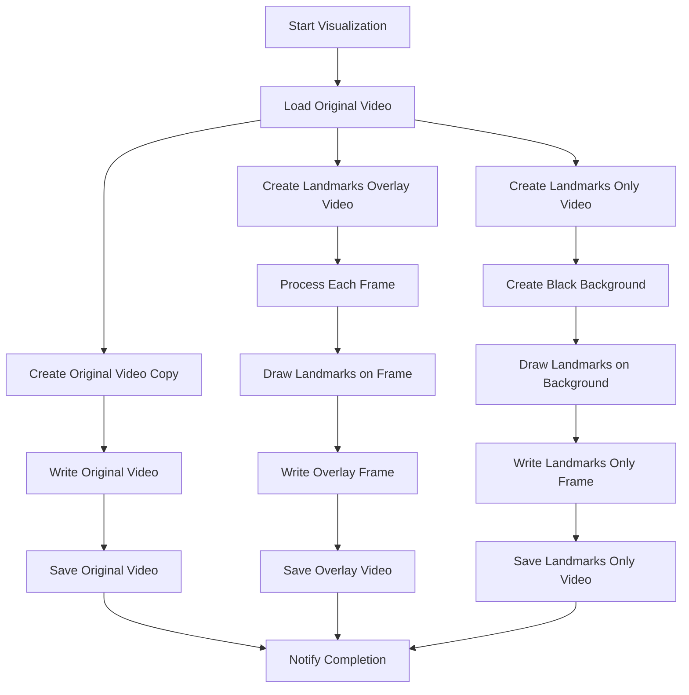
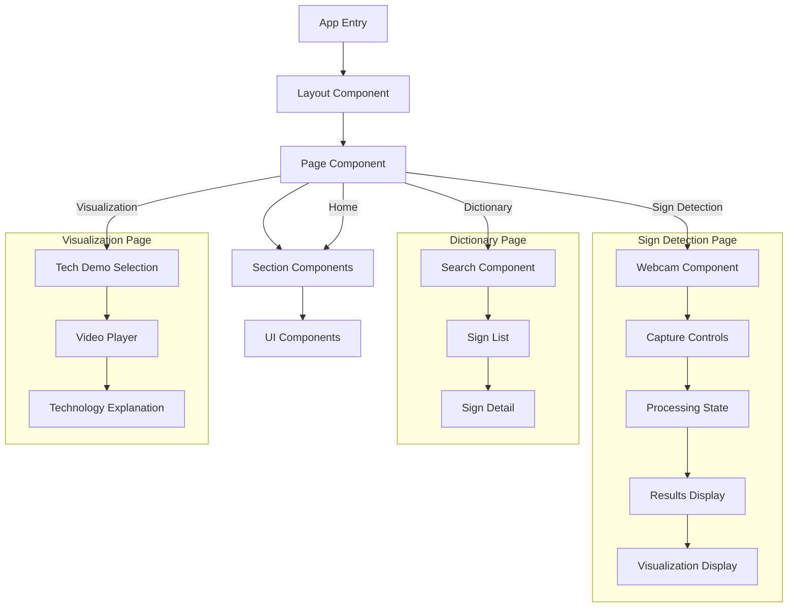

# System Flowcharts

This document provides detailed flowcharts for key processes in the SignEase application.

## Sign Detection Process

## User Interaction Flow

## Backend Processing Pipeline

## Data Processing Flow

## Visualization Generation Process

## Frontend Component Interaction

